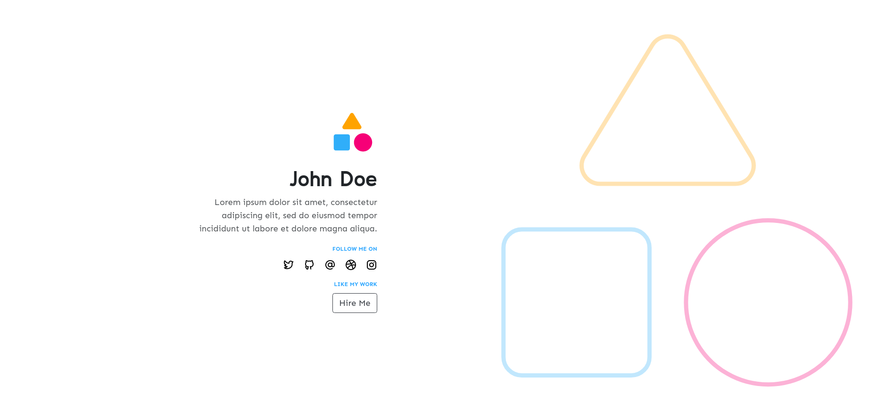

<div align="center">
<h1>Minimal Portfolio Website</h1>
This a minimal portfolio website for designers and developers.
</div>
 &nbsp;


* More features will be added according to the user needs.

Install jekyll and bundler:
```bash
gem install jekyll bundler
```

Install gems:
```bash
bundle install
```

Build and serve locally with:
```bash
bundle exec jekyll s
```

The site should now be available at http://0.0.0.0:4000/

<div align="center">
<sub><sup>© 2021 Vyshnav, licensed under the <a href="./LICENSE">MIT License</a>.</sup></sub>
</div>